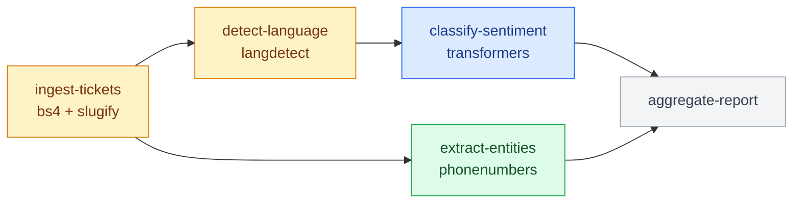

# snowflake-sproc-task-graph-pipeline

A reference pipeline for deploying a **Snowflake Task Graph** (a DAG of
Snowflake Tasks) where each task runs as a **permanent Python stored
procedure**, driven end-to-end by GitLab CI. Modeled on the sibling
[`snowflake-spcs-task-graph-pipeline`](../snowflake-spcs-task-graph-pipeline)
repo, which does the same thing for SPCS container jobs instead.

Each node in the graph is a Python package under `procedures/<name>/src/`.
The dependency edges between nodes come from each node's own
`procedure.yaml` (same idea as that repo's `service.yaml`); Snowflake-side
config (database, schema, stage, DAG name) comes from `task-graph.yaml`.
Adding a task to the graph is just adding a new `procedures/<name>/`
directory -- no CI or deploy-script changes required.

## The example graph: support-ticket enrichment

The graph in `procedures/` is a worked example, not just stubs: a
multi-stage pipeline that normalizes raw support tickets, detects their
language, classifies sentiment with a small transformer model, extracts
structured entities, and joins the results. It's a branching DAG, not a
straight line:



🟡 mixed (Anaconda `packages:` + vendored) &nbsp;·&nbsp; 🔵 Anaconda `packages:` only &nbsp;·&nbsp; 🟢 vendored only &nbsp;·&nbsp; ⚪ no external dependency

Each node operates on a small embedded sample payload and returns a
descriptive string, rather than doing real Snowflake table I/O -- `session`
stays present but unused, per the calling convention, and `depends_on`
expresses the data dependency a production version would have (each stage
reading the table the previous one wrote). The point of the example is the
*dependency* story, which every non-leaf node has a different flavor of:

| Node | External library | Where it comes from |
|---|---|---|
| `ingest-tickets` | `beautifulsoup4` (HTML stripping), `python-slugify` + `text-unidecode` | bs4 via Anaconda `packages:`; slugify + its own dependency vendored (a 2-level chain) |
| `detect-language` | `langdetect` (+ `six`) | `six` via Anaconda `packages:`, `langdetect` vendored -- a node mixing both |
| `classify-sentiment` | `transformers` + `pytorch`, plus a model fetched at runtime | both via Anaconda `packages:`, nothing vendored -- see below |
| `extract-entities` | `phonenumbers` | vendored -- a single, data-heavy package rather than a chain |
| `aggregate-report` | none | plain fan-in join |

## Why stored procedures need a "build" step at all

A node's application logic is never inlined into a deploy script as a
Python string -- it's a real folder (`procedures/<name>/src/`) that can be
as deep and multi-module as it needs to be. Snowflake's `CREATE PROCEDURE` supports
pointing `HANDLER` at a function inside code that's already sitting on a
stage, with no `AS` clause needed -- so, just like the SPCS pipeline builds
an image once and references it by tag, this pipeline uploads each node's
code once (as a permanent stored procedure) and has task bodies reference it
by name.

## How it works

The GitLab pipeline (`.gitlab-ci.yml`) has three stages:

0. **`validate`** -- runs both scripts' `--dry-run` mode (manifest parsing,
   cycle detection) on every merge request as well as on `main`, so a bad
   `procedure.yaml` is caught before it merges, not after it breaks the
   next real deploy.
1. **`register`** -- `ci/lib/register_procedures.py` scans
   `procedures/*/procedure.yaml`, and for each node uploads its entrypoint
   file plus everything else alongside it in `src/` (via Snowpark's
   `session.sproc.register_from_file`, using `imports` for the rest of the
   package -- auto-zipped, structure preserved) and `CREATE OR REPLACE`s a
   permanent stored procedure named `<name>_proc`. This never imports a
   node's own code into the CI process, so this script's dependencies stay
   fixed (`snowflake-snowpark-python`, `pyyaml`) regardless of what any
   node's handler code itself imports.
2. **`deploy`** -- `ci/lib/deploy_task_graph.py` scans the same manifests to
   discover nodes and edges, then builds and deploys a
   `snowflake.core.task.dagv1.DAG` via the Snowflake Python API. Each task's
   body is a single `CALL <name>_proc()` statement invoking the procedure
   the register stage already created -- the one statement in this whole
   pipeline that references an object by name rather than going through
   `snowflake.core`.

`register` and `deploy` only run on pushes to `main`; `validate` also runs
on merge requests. `deploy_task_graph` runs under a named GitLab
`environment: production`, so it can be put behind a protected environment
(required approvers / allowed deployers) without any pipeline changes.

## Repo layout

```
.gitlab-ci.yml            Pipeline definition (stages, required CI variables)
task-graph.yaml            Snowflake-side config: database, schema, stage, DAG name
procedures/<name>/
  procedure.yaml            name, depends_on (edges in the DAG), entrypoint, handler
  pyproject.toml, uv.lock   Exact-pinned deps -- single source of truth for both the
                             Anaconda `PACKAGES` requested at deploy and what `uv sync`
                             installs locally for testing, see below
  src/                       The node's application code -- its own folder structure,
                             can be arbitrarily complex, never nested inline elsewhere
  vendor/                    Optional. Wheels for dependencies not on Snowflake's
                             Anaconda channel -- auto-picked-up, see below
ci/
  pyproject.toml, uv.lock   Python deps for the register/deploy steps (managed with uv)
  lib/
    get_snowflake_token.sh   Azure AD client-credentials -> Snowflake OAuth token
    register_procedures.py   Discovers nodes, uploads code, creates permanent procedures
    deploy_task_graph.py     Discovers the graph, builds + deploys the DAG
```

## Declaring a node's dependencies

Each node's `procedures/<name>/pyproject.toml` `[project.dependencies]` is
the single source of truth for its Anaconda-channel dependencies --
exact-pinned (`pkg==version`), so `register_procedures.py` requests exactly
those pins from Snowflake (`CREATE PROCEDURE ... PACKAGES`) *and* a
`uv sync` in that directory installs the identical versions for local
testing. One list instead of two that can silently drift apart or typo out
of sync with each other.

Snowflake's Anaconda channel occasionally names a package differently than
PyPI does (`pytorch` vs. PyPI's `torch` is the standing example in this
repo) -- `register_procedures.py`'s `ANACONDA_PACKAGE_NAME_OVERRIDES` maps
the PyPI name in `pyproject.toml` to the Anaconda name sent to Snowflake, so
`pyproject.toml` itself only ever needs to list normal, `uv`-resolvable PyPI
names.

## Using a dependency that isn't on Snowflake's Anaconda channel

For an internal/private package, or a pip-only dependency with no Anaconda
build, there's no Anaconda package name to request at all, so it has to be
vendored as a wheel instead:

1. Download (or build) the wheel, *and* the wheel for every dependency it
   pulls in that also isn't on the Anaconda channel -- vendoring a package
   usually means vendoring its whole non-Anaconda dependency closure, not
   just the top-level package. Commit them all under
   `procedures/<name>/vendor/`.
2. `register_procedures.py` picks up every file in `vendor/` automatically
   and passes it to `register_from_file`'s `imports` alongside the sibling
   `.py` files from `src/`, the same way Snowpark handles any other
   zip/wheel import. No script change needed.
3. Also list the same package, pinned to the same version as the wheel you
   just vendored, in that node's `pyproject.toml` under
   `[dependency-groups] vendored = [...]` (with
   `[tool.uv] default-groups = ["vendored"]` so a plain `uv sync` installs
   it too). This is *not* sent to Snowflake's `PACKAGES` -- the committed
   wheel is the real deploy artifact -- it exists purely so the same version
   is installed locally for testing the handler.

This only works for pure-Python wheels: Snowflake's stored procedure sandbox
runs on Linux x86_64, so a wheel with a compiled/native extension built on
your own machine won't load there.

Snowflake unpacks a `.zip`/`.whl` import to a real directory in the sandbox
before adding it to `sys.path` -- it isn't left compressed. That matters for
packages that reach for their own bundled data files with a plain `open()`
call instead of `importlib.resources`: they need the unpacked-directory
behavior to work at all. When testing a vendored wheel locally, extract it
to a directory and put *that* on `sys.path` (not the `.whl` file itself) to
match what Snowflake actually does -- `langdetect` (used by
`detect-language`) is a real example of a package that needs this; testing
it via raw zipimport instead fails on its bundled `messages.properties`
file.

`ingest-tickets/vendor/` (a 2-level chain: `python-slugify` depends on
`text-unidecode`), `detect-language/vendor/` (a single package, `langdetect`),
and `extract-entities/vendor/` (a single data-heavy package, `phonenumbers`)
are all worked examples, vendored the same way:

```sh
pip download --no-deps -d procedures/ingest-tickets/vendor python-slugify text-unidecode
pip download --no-deps -d procedures/extract-entities/vendor phonenumbers
# langdetect only publishes a source distribution on PyPI, no wheel --
# `pip wheel` builds one locally instead of just downloading it:
pip wheel --no-deps -w procedures/detect-language/vendor langdetect
```

### Data too big to commit: the sentiment model

`classify-sentiment` needs real fine-tuned model weights
(`distilbert-base-uncased-finetuned-sst-2-english`, ~268MB), not a Python
package -- so it doesn't go through `vendor/` at all, and it isn't
committed either: at ~268MB it's over GitHub's 100MB push limit without
Git LFS, and this repo deliberately doesn't use LFS.

Instead, `src/handler.py` builds its `pipeline("sentiment-analysis", ...)`
at module scope, by model id rather than a local path -- `transformers`
resolves that id against the Hugging Face Hub and downloads the weights
itself. Module scope matters: it means the download happens once, at
stored procedure initialization on a cold start, and the same in-memory
classifier is reused for every call on that warm sandbox, rather than
being re-fetched per invocation.

That requires the stored procedure sandbox to reach `huggingface.co` at
runtime, which Snowflake only allows via an `EXTERNAL ACCESS INTEGRATION`
(with a `NETWORK RULE` permitting that host) created ahead of time in the
account -- a one-time prerequisite this pipeline doesn't create, same as
the Azure AD / OAuth security integration in `.gitlab-ci.yml`.
`procedure.yaml`'s `external_access_integrations:` field names it, and
`register_procedures.py` passes that straight through to
`register_from_file`'s `external_access_integrations` argument -- no
per-node special-casing.

`transformers` and `pytorch` themselves are requested via
`pyproject.toml`'s `[project.dependencies]` (Snowflake's Anaconda channel
carries both, for Snowpark ML) -- vendoring is for filling gaps in the
Anaconda channel, not a substitute for it.

## Adding a task

1. Create `procedures/<name>/src/` with the task's application code --
   whatever folder structure it needs. The entrypoint file must define a
   function whose first parameter is the Snowpark `Session` (even if
   unused), per Snowflake's Python stored procedure calling convention.
2. Create `procedures/<name>/procedure.yaml`:
   ```yaml
   name: <name>
   depends_on: [<upstream-task-name>, ...]
   entrypoint: src/handler.py
   handler: run
   packages: [snowflake-snowpark-python]
   ```
3. Push to `main`. The new node is picked up automatically on the next
   register and deploy.

## Prerequisites (one-time, not managed by this pipeline)

- A Snowflake `SECURITY INTEGRATION` of `TYPE = EXTERNAL_OAUTH` configured
  for Azure AD, with a role mapping for the CI service principal.
- An Azure AD App Registration with a client secret, granted access to the
  scope registered against that Snowflake integration.

## Required GitLab CI/CD variables

Set under **Settings > CI/CD > Variables** (mark `AZURE_CLIENT_SECRET` as
Masked + Protected):

| Variable | Description |
|---|---|
| `AZURE_TENANT_ID` | Azure AD tenant ID |
| `AZURE_CLIENT_ID` | Azure AD App Registration client ID |
| `AZURE_CLIENT_SECRET` | Azure AD App Registration client secret |
| `SNOWFLAKE_OAUTH_SCOPE` | e.g. `api://<app-id>/.default` |
| `SNOWFLAKE_ACCOUNT` | Account identifier, e.g. `myorg-myaccount` |
| `SNOWFLAKE_USER` | Login name the Azure token maps to |
| `SNOWFLAKE_ROLE` | e.g. `tutorial_role` |
| `SNOWFLAKE_WAREHOUSE` | e.g. `tutorial_warehouse` |

## Local dry run

Both scripts support `--dry-run`, which validates the graph (including
cycle detection) and prints what each stage would do without touching
Snowflake:

```sh
cd ci
uv sync
uv run python lib/register_procedures.py --dry-run
uv run python lib/deploy_task_graph.py --dry-run
```
